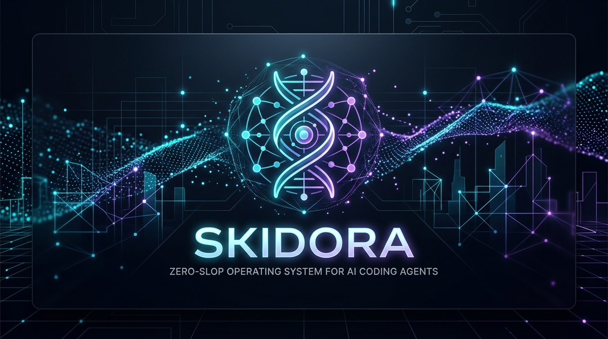

<div align="center">



# Skidora 🧬

**The Lean Operating System & Memory Engine for AI Coding Agents.**  
*Eliminate agent hallucination, context amnesia, and ceremony across any IDE and model.*

[](https://skills.sh)
[](#supported-agents)
[](LICENSE)

[Quickstart](#quickstart) • [The Crisis We Solve](#the-crisis-we-solve) • [Adaptive Principles (KISS, DRY, SOLID)](#-adaptive-engine--core-principles) • [The 7-Rung Ladder](#-the-7-rung-ladder) • [Execution Loop](#-the-adaptive-execution-loop) • [Core Skills Matrix](#-core-skills-matrix) • [Network Debugging](#-network-debugging--production-security) • [Helix Memory](#-helix-single-file-memory-contract) • [Security Transparency](#-security-audit--transparency) • [Optional Extras](#-neovim--rust-engine-optional-extras)

</div>

---

## ⚡ The Crisis We Solve

AI coding assistants are brilliant at syntax, but catastrophic at engineering discipline and developer wellness:

| The Agent Slop Problem | What Actually Happens | How Skidora Fixes It |
|---|---|---|
| **Ceremony Suffocation** | Agent writes 5 markdown files (`plan.md`, `architecture.md`, `artifact-index.md`) and a 400-word essay for a 1-line date fix. | **Adaptive Surgical Execution:** Default to the **7-Rung Ladder** (in `skidora-when-not`). Shortest working diff, ≤3 lines response, zero paperwork. |
| **Context Amnesia** | Agent resets every chat turn; forgets past architecture decisions and repeats previous bugs. | **Single-File Helix Memory:** Silent, background persistence in `.skidora/recover.md`. Zero file bloat. |
| **Fake Completion** | Agent writes `// TODO: connect db` or returns hardcoded mock objects and says *"Done!"* | **Two-Pass Proof-of-Work:** Pass A cites static router/handler path:line; Pass B requires real command proof with mandatory `UNVERIFIED` fallback. |
| **Hallucinated Endpoints** | Agent invents convenient API paths (`/api/v1/update-profile`) that don't exist in the router. | **NLP-to-Endpoint Mapping:** Strictly enforces route extraction against real code files before touching any handler. |
| **Networking & CORS Crashes** | Agents deploy endpoints with broken CORS, missing timeouts, or leaked auth tokens in query params. | **Jam-if-MCP & Hardening:** Uses Jam MCP if available, or user-pasted cURL/HAR traces; enforces explicit timeouts and CORS defense. |
| **Code Bloat & Reinvented Wheels** | Agents install new libraries for things that take 2 lines of standard library code. | **YAGNI, KISS & DRY Enforcement:** Reuses existing utilities and stdlib; halts at the lowest rung that holds. |

---

## 📐 Adaptive Engine & Core Principles

Skidora bakes timeless software engineering principles directly into agent execution:

### The Engineering Creed
1. **KISS ("Do it simple"):** The shortest working diff that solves the root cause wins. Stop at the lowest rung that holds.
2. **DRY ("Do it once"):** Reuse existing codebase helpers and standard libraries. In memory, maintain **one single `.skidora/recover.md`** ledger instead of duplicating state.
3. **YAGNI (You Aren't Gonna Need It):** Never generate speculative abstractions, unrequested classes, or paperwork files.
4. **SOLID Architectural Discipline:** Single Responsibility per edit, Open/Closed for extensibility, Liskov substitution on replacements, Interface Segregation without forcing unused ceremonies, and Dependency Inversion on stable abstractions.

---

## 🪜 The 7-Rung Ladder

Before writing any new code, agents must step down the ladder and **stop at the first rung that holds**:

| Rung | Level | Action Rule |
|---|---|---|
| **1** | **YAGNI** | Does this need to exist? Skip if speculative or unrequested. |
| **2** | **In Codebase** | Reuse existing helpers, types, or utilities (DRY: "Do it once"). |
| **3** | **Standard Library** | Use language built-in primitives instead of adding packages. |
| **4** | **Native Platform** | Leverage HTML5, CSS, or database schema constraints. |
| **5** | **Existing Dependency** | Use libraries already declared in `package.json` / `Cargo.toml`. |
| **6** | **One-Liner** | Keep it cleanly in one line if possible (KISS: "Do it simple"). |
| **7** | **Minimum Viable Code** | Write the absolute minimum safe code that fixes the root cause. |

> 📖 The complete ladder specification is maintained in [`skills/skidora-when-not/SKILL.md`](./skills/skidora-when-not/SKILL.md).

---

## 🚀 Quickstart

Install the 6-skill Skidora pack globally across your coding agents (no CLI or binary required):

```bash
# If upgrading from legacy v1/v2, prune obsolete zombie skills first:
npx skills remove skidora-planning skidora-gsd skidora-network skidora-intake skidora-graphifier skidora-frontend skidora-cd skidora-security skidora-agent-handling -g -y 2>/dev/null || true

# Install the canonical 6-pack:
npx skills add Atofinite5/skidora -g -y
```

### ⚡ For Cursor, Claude Code, and Codex (Automated Symlinks)
Run our idempotent installer to register the pack with native symlink discovery across `~/.cursor/skills/`, `~/.claude/skills/`, and `~/.codex/skills/`:

```bash
bash scripts/install.sh
```

*(After installing, reload Cursor window: `Cmd + Shift + P` -> "Developer: Reload Window" or restart your IDE).*

### Inspect the Pack

```bash
npx skills add Atofinite5/skidora --list
```

---

## 🔁 The Adaptive Execution Loop

Skidora automatically routes between **Surgical Mode** (90% of daily work) and **Blueprint Mode** (10% structural work):

```mermaid
flowchart TD
  user["User Command"] --> isStructural{"Is it Public API Change, DB Migration, or /plan?"}
  
  isStructural -->|No (90% Daily Work)| surgical["⚡ SURGICAL MODE (7-Rung Ladder)
- Stop at the first rung that holds
- KISS ('Do it simple'), DRY ('Do it once'), YAGNI
- Shortest working diff wins
- Max 3 lines of summary explanation
- Silent 1-line append to .skidora/recover.md"]
  
  isStructural -->|Yes (10% Structural)| blueprint["🛡️ BLUEPRINT MODE
- 1. Load Helix recover.md
- 2. Router mapping to real code
- 3. Pass A: open router/handler and cite path:line
- 4. Pass B: literal command (negative + positive) or UNVERIFIED
- 5. 3-line Proof-of-Work badge
- 6. Append verified milestone to recover.md"]
```

---

## 🧩 Core Skills Matrix

Skidora consists of **six clean, focused markdown skills** (all markdown-only, no CLI required):

| Skill | Module Directory | Core Capability |
|---|---|---|
| **`skidora`** | [`skills/skidora`](./skills/skidora) | **The Master Orchestrator:** Adaptive loop, production security, boot contract, and standalone/sibling dispatch. |
| **`skidora-when-not`** | [`skills/skidora-when-not`](./skills/skidora-when-not) | **Adaptive Gatekeeper:** Canonical 7-Rung Ladder, SOLID, KISS ("Do it simple"), DRY ("Do it once") (≤3 lines output). |
| **`skidora-helix`** | [`skills/skidora-helix`](./skills/skidora-helix) | **Single-File Memory:** Silent, background state persistence via `.skidora/recover.md` (<40 lines). |
| **`skidora-verify`** | [`skills/skidora-verify`](./skills/skidora-verify) | **Proof-of-Work:** Dual-pass verification (Pass A static router path:line + Pass B command with UNVERIFIED rule), Jam-if-MCP or user traces, and 3-line badge. |
| **`skidora-backend`** | [`skills/skidora-backend`](./skills/skidora-backend) | **API Discipline:** Natural-language to real router mapping; in-memory torn router resolution. |
| **`skidora-erlang-elixir`** | [`skills/skidora-erlang-elixir`](./skills/skidora-erlang-elixir) | **BEAM/OTP (BEAM Repos Only):** Phoenix, LiveView, Mix/Rebar3 (load only if `mix.exs`/`rebar.config` exists). |

---

## 🌐 Network Debugging & Production Security

When debugging network failures, console errors, or bug reports, Skidora agents apply the **Jam-if-MCP** protocol:

### Jam-if-MCP Protocol
1. **Jam MCP (When Available):** If a Jam MCP server/tool (`jam_*`) is configured in the agent session, invoke it directly to inspect session replays, console logs, and network requests.
2. **User-Pasted cURL Commands (CLI/Local):** Reproduce failed network traffic directly via local CLI execution (`curl -v -X <METHOD> <URL>`).
3. **User-Pasted HAR Dumps / DevTools Logs:** Filter entries with `response.status >= 400` to pinpoint failed requests. Never hallucinate an unauthenticated web fetch if Jam MCP is not present.

### Production Network Hardening Rules
1. **Zero Credentials in Query Params:** Never pass API keys or bearer tokens in URLs (`/api?token=...`). Always use headers (`Authorization: Bearer <token>`).
2. **Strict CORS Policy:** Whitelist specific origins. Never combine wildcard `*` with `credentials: true`.
3. **Mandatory Timeouts:** Every network request must have an explicit timeout (5s–10s) and exponential backoff retry.
4. **SSRF Defense:** Sanitize and whitelist all user-provided URLs against internal RFC 1918 subnets (`127.0.0.1`, `10.0.0.0/8`, `169.254.169.254`).

---

## 💾 Helix Single-File Memory Contract

Skidora eliminates both context amnesia and markdown ceremony by keeping **one single, compact ledger** inside `.skidora/`:\n
```
your-project/
└── .skidora/
    └── recover.md       # Single-file compact ledger (<40 lines): past milestones & active state
```

### Clean, Silent Updates
Instead of dumping multiple planning files, Skidora quietly appends one line upon completing verified work:
```markdown
# Helix Recover Ledger
- [2026-09-18] Fixed bookingKpis day window in src/kpis.ts. (14/14 tests pass)
- [2026-09-18] Hardened CORS whitelist on /api/v1/checkout. (Pass A & B verified)
```

### Pruning Rule (<40 lines)
When `.skidora/recover.md` approaches 40 lines, prune historical lines:
- **Keep:** Goal, Next, Active Routes (if any), and the last 8 milestone lines.
- **Discard:** Older milestone lines preceding the last 8.

---

## 🛡️ Security Audit & Transparency

- **100% Static Markdown:** Skidora is pure agent instruction markdown. It contains zero background binaries, zero telemetry, and zero unprompted network calls.
- **Socket / Snyk Med Risk Static Analysis Note:** Automated scanners on `skills.sh` flag command syntax examples (e.g. `curl`, `npm test`, shell execution guidance) in prompt documentation as medium-risk heuristic alerts. All commands in Skidora are strictly instructions executed interactively in your developer-controlled terminal environment.

---

## 🦀 Neovim & Rust Engine (Optional Extras)

Skidora requires **no CLI or binary** — all memory contracts and skills run via standard Markdown in any LLM or IDE.

For terminal power users who want editor-native memory manipulation, Skidora includes an optional high-performance **Rust CLI** and **Neovim Lua plugin**:

```bash
# Build the optional native CLI
cargo build --release

# Run CLI commands directly
./target/release/skidora status
./target/release/skidora recover --global
```

In Neovim:
```vim
:SkidoraStatus    " View project status in a floating window
:SkidoraRecover   " Inspect the compressed recovery prompt
```

---

## 🛡️ The Zero-Slop Guarantee

Before your agent claims an API or structural feature is "finished", Skidora forces it to provide this standardized **Proof-of-Work Badge** ([templates/proof-of-work.md](templates/proof-of-work.md)):

```markdown
[Skidora Proof-of-Work]
- Pass A (Static): app/api/billing/route.ts:42 — Route registered in router with schema validation.
- Pass B (Runtime): curl -s -o /dev/null -w "%{http_code}" -X POST http://localhost:3000/api/v1/billing -> 200 OK (exit 0)
- Regression: 14/14 tests green (0 failures)
```

If runtime verification could not be executed this turn, the agent must output `UNVERIFIED`:
```markdown
[Skidora Proof-of-Work]
- Pass A (Static): app/api/billing/route.ts:42 — Route registered in router with schema validation.
- Pass B (Runtime): UNVERIFIED — Server not running locally during this turn.
- Regression: 14/14 tests green (0 failures)
```

No more broken builds. No more fake mocks. No ceremony suffocation.

---

## 🤝 Contributing & Community

Skidora is open-source under the [MIT License](LICENSE). Contributions, bug reports, and new language/framework modules are welcome!

1. Fork the repo: [`Atofinite5/skidora`](https://github.com/Atofinite5/skidora)
2. Create your feature branch: `git checkout -b feature/awesome-skill`
3. Commit your changes: `git commit -m "feat: add awesome skill"`
4. Push to the branch: `git push origin feature/awesome-skill`
5. Open a Pull Request against `develop`.

---

<div align="center">
Made with ⚡ by <a href="https://github.com/Atofinite5">Atofinite5</a> for developers who demand real results from AI.
</div>
