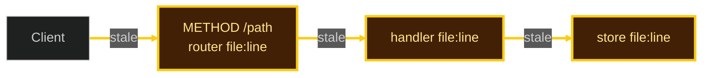

# Backend, NLP-to-Endpoints, and Connection Health Map

An endpoint is real ONLY if it exists in router code, an OpenAPI/schema spec, or a verified live route table. Senior review is the map: **is the hop linked, and what color is the hop?**

## NLP -> Real Route Mapping

1. Extract intent, entity, and constraints from the prompt.
2. Match to an existing handler and router file by name, path, or schema.
3. If no match exists, flag as Blueprint (new endpoint). Never silently invent a path.
4. Record verified route in `.skidora/recover.md`:
   `Route: <METHOD> <path> -> <handler file:line>`

## Torn Router Resolution (In-Memory Graph)

When a codebase has torn routes, dual backends, or conflicting middleware:
1. Scan router files (`src/routes/*`, `app/api/*`, `router.ex`, `*_web/router.ex`).
2. Build an in-memory map: `Route -> Middleware/Auth -> Controller/Handler -> Database/Store`.
3. Resolve conflicts at the router. Do **not** write `graph.md` unless the user asked for a file.

## Connection Health Map (Claude cowork reply)

**Draw only when the user asked** for a map, architecture, mermaid, connections, or “is it wired?”. After a normal Blueprint route change, emit the 3-line Proof-of-Work badge only. Do not auto-dump a diagram.

This is **not** Surgical Mode. Canonical stencil: hub `templates/connection-health.md`.

### 1. Scan first (this turn)

The first map action is a real search. Do not draw until it returns paths:

```bash
rg -n -g '!target/**' -g '!node_modules/**' \
  '^(export )?(async )?(function )?(GET|POST|PUT|PATCH|DELETE)\b|router\.(get|post|put|patch|delete)|scope |get |post ' \
  app/api routes src/routes lib --glob '*.{ts,js,ex,exs,go,rs}'
```

Also open matching router files (`app/api/**/route.ts`, `routes/*`, `router.ex`). Quote `file:line` from that output.

If the scan finds no routers, say so and **do not invent HTTP boxes**. Map only modules that the scan (or `ls` of the requested slice) actually listed.

Cap at **12 nodes**. Prefer the requested slice.

### 2. Default yellow, then upgrade from this turn only

Every hop found by the scan starts **yellow**.

| Class | Color | Stroke | Upgrade rule |
|---|---|---|---|
| `stale` | **yellow** `#facc15` | 3px | Default. Linked in code; Pass B not run this turn (`UNVERIFIED`). |
| `ok` | **green** `#4ade80` | 2px | Pass A `file:line` **and** Pass B real command/test of **that hop this turn**. |
| `torn` | **orange** `#fb923c` | 4px | This turn’s compiler/test log names that file as a warning, missing schema, or unwired handler. |
| `down` | **red** `#f87171` | 5px | This turn’s log shows compile error, panic, 5xx, or dangling import for that file. |

No log this turn → stay yellow. Never infer orange/red from “it looks risky.” Never paint green because the name looks complete.

### 3. Boxes

- **Actor exception:** one unlabeled actor is allowed (`Client`, `Browser`, `Caller`). No `file:line`.
- Every other box **must** cite a real `file:line` from the scan. If there is no file, **omit the node**.
- Never copy sample paths. There is no canonical `/api/v1/billing/webhook` in this stencil.

### 4. Draw (placeholders only)

Paint **both** node `class` and matching `linkStyle`. Status **text** is required even if mermaid ignores stroke-width.



Replace `METHOD /path` and `file:line` with **this scan’s** hits. Keep every hop yellow until this turn upgrades it.

### 5. Cowork reply shape (always)

1. **Status (required text):** `Connection health — N hops. G green / Y yellow / O orange / R red.`
2. **Mermaid** (optional extra). If mermaid fails to color, the status line still stands.
3. **Brightest hop:** worst color, `file:line`, what the log said — or `UNVERIFIED`.
4. **Next:** next physical edit. Stop.

Do not write `architecture.md` / `graph.md`.

### 6. Fail the turn if

- Drew before scanning, or copied a path not in this repo (including any sample webhook).
- A non-actor node has no `file:line`.
- A hop is green without Pass A + Pass B **this turn**.
- Orange/red without this turn’s log naming that file.
- Map drawn when the user did not ask for map / architecture / mermaid / connections / “is it wired?”.
- Map written to a markdown file the user did not ask for.

## Backend Hardening Rules

- **Schema Validation:** Validate incoming payloads with the project's existing schema library (Zod, Joi, Pydantic, Ecto).
- **Network Resilience:** Explicit 5s–10s timeouts and sanitized error responses.
- **Zero Secrets in Logs:** Never log authorization headers, passwords, or tokens.
- **Side Effects Guard:** Mutations, webhooks, or deletions require explicit verification.
