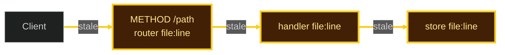

# Connection Health Map (in-chat only)

Draw **only when the user asked** for a map / architecture / mermaid / connections / “is it wired?”. Never write `graph.md` unless they asked for a file.

Scan first. Every hop starts **yellow**. One unlabeled actor (`Client`) is allowed. Every other box needs a real `file:line` from this turn’s scan.

Status text is required (mermaid stroke-width may not render):

`Connection health — N hops. G green / Y yellow / O orange / R red.`

Replace placeholders with this repo’s scan hits. Do not copy sample API paths. Upgrade yellow → green/orange/red only from this turn’s Pass B or compiler/test log.

| Class | Color | Meaning |
|---|---|---|
| `stale` | yellow | Default. Linked; Pass B `UNVERIFIED` this turn. |
| `ok` | green | Pass A + Pass B of that hop **this turn**. |
| `torn` | orange | This turn’s log: warning / missing schema / unwired handler on that file. |
| `down` | red | This turn’s log: compile error / panic / 5xx / dangling import on that file. |

Reply: status counts → mermaid → brightest hop `file:line` → next edit. Stop.
