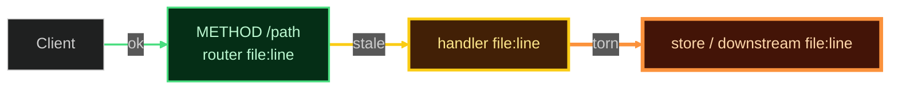

# Connection Health Map (in-chat only)

Draw this in the reply. Never write `graph.md` unless the user asked for a file.

Brighter / thicker stroke = more danger. No invented nodes. Every box cites a real `file:line` or is omitted.

| Class | Color | Stroke | Meaning |
|---|---|---|---|
| `ok` | green | 2px | Linked **and** verified this turn (Pass A `file:line` + Pass B real command, or compile/test of that hop). |
| `stale` | yellow | 3px | Linked, Pass B `UNVERIFIED`. Connection exists; proof was not run. |
| `torn` | orange | 4px | Linked with a defect on the hop (missing schema, rustc warning, type error, handler not wired). |
| `down` | red | 5px | Broken / danger (compile error, panic, 5xx, dangling edge, missing target). |

Reply shape (Claude cowork):
1. One status sentence: counts per color.
2. The mermaid.
3. The brightest (worst) hop: `file:line` + what is wrong.
4. Next physical edit. Stop.
